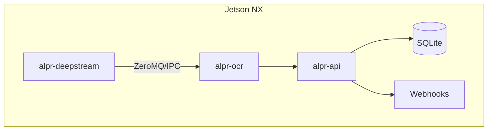

# Automatic License Plate Recognition (ALPR) — Indonesia | Jetson Xavier NX (16 GB, JetPack 5.1.5)

**Audience:** solo developer. **Scope:** 1 RTSP CCTV feed (expandable). **Run mode:** 24/7 unattended with self‑healing. **Output:** robust event API + images. **License constraint:** permissive/open or NVIDIA-included.

---

## 0) Quick Outcomes & Guardrails

* **Accuracy goal:** ≥95% plate-level exact match on internal validation; ≥98% character-level accuracy.
* **Latency/Throughput:** ≥20 FPS on 1080p single stream on NX 16 GB (FP16 TRT); p95 end‑to‑end <80 ms.
* **Uptime:** unattended; auto-restart on crash; automatic RTSP reconnection.
* **Interfaces:** HTTP + WebSocket API; optional Kafka/MQTT broker events; schema versioned.
* **Privacy/Safety:** redact faces on exported snapshots when needed; store only required data; rotate logs.

---

## 1) What We’re Building (High-Level)

```text
[Hikvision RTSP 1080p]
     │ (GStreamer/NVDEC)
     ▼
[DeepStream pipeline]
  • Primary GIE: Plate Detector (YOLOv9, TRT)
  • Tracker: NvDCF (stable track IDs)
  • Plate ROI Crop + Rectify (OpenCV)
     │
     ├──► [OCR Service (PaddleOCR TRT)] → text + confidences
     │
     └──► [Event Packager]
             ├─ HTTP/WebSocket (FastAPI)
             ├─ Optional: nvmsgbroker → Kafka/MQTT
             └─ Snapshots (plate/vehicle) store + metadata DB (Lite/SQLite)
```

### Containers/Processes (1 node: Jetson NX)

* **`alpr-deepstream`**: RTSP ingest, detector, tracker, cropper; emits plate crops to a local ZeroMQ/IPC queue.
* **`alpr-ocr`**: OCR microservice (TensorRT) that consumes crops, returns strings + per-char confidences.
* **`alpr-api`**: FastAPI + Uvicorn serving `/v1/*`, webhooks, and WebSocket; writes events to SQLite/CSV and optional message broker.
* **`node-exporter` (optional)**: metrics shipper; otherwise expose Prometheus-style `/metrics` in API.

---

## 2) Camera & Scene Notes (from your sample frames)

**Files:**

* `/mnt/data/MG3 Tengah Gate 2_CCTV1_B9350BDI_150316.jpg` (day, close, front)
* `/mnt/data/MG3 Tengah Gate 2_CCTV1_B9418QW_100141.jpg` (day)
* `/mnt/data/MG3 Tengah Gate 2_CCTV1_A8186VM_145240.jpg` (day)
* `/mnt/data/MG3 Tengah Gate 2_CCTV1_B9016PEN_114548.jpg` (day)
* `/mnt/data/MG3 Tengah Gate 2_CCTV1__030445.jpg` (night, glare)
* `/mnt/data/MG3 Tengah Gate 2_CCTV1__010813.jpg` (night)
* `/mnt/data/MG3 Tengah Gate 2_CCTV1__013612.jpg` (night)
* `/mnt/data/MG3 Tengah Gate 2_CCTV1__021530.jpg` (night)

**Observations & Requirements:**

* Plate is typically **frontal** at ~1–4 m; often near image bottom‑right; height ~40–120 px in 1080p.
* Night shots include **strong headlights** and colored LED bars → use CLAHE + deblurring and temporal vote.
* Multiple truck classes; bumper heights vary; use **tracker** to maintain per‑vehicle identity while stopped.
* Recommend: shutter 1/250–1/500 sec when moving; fixed exposure; enable WDR; IR cut if available.

**Minimum ROI heuristics (for detection acceptance):**

* Don’t OCR if plate bbox height < **28 px** or aspect ratio ∉ [1.5, 5.0]. Queue for second look when vehicle is closer.

---

## 3) Indonesian Plate Format & Post‑Processing

**General pattern (current civilian plates):**

```
PREFIX  : 1–2 letters (region code), e.g., A, B, D, F, E, T, Z, etc.
NUMBER  : 1–4 digits
SUFFIX  : 0–3 letters (series)
Example : "B 1234 XYZ", "A 8628 GL", "B 9033 BEK"
```

**Regex (loose, uppercase):**

```
^[A-Z]{1,2}\s?\d{1,4}\s?[A-Z]{0,3}$
```

**Notes & helpers:**

* Disallow ambiguous letters in OCR post‑proc where useful: `I↔1`, `O↔0`, `S↔5`, `B↔8`, `Z↔2`, `G↔6`, `Q↔0`.
* Region‑aware whitelist (extendable): `A` (Banten), `B` (DKI Jakarta), `D/F/E/Z/T` (West Java variants), etc. Start with seen prefixes: **A**, **B**.
* Use **Levenshtein** constrained search: pick candidate closest to regex‑valid strings; prefer region whitelist.
* **Temporal majority voting:** keep per‑track buffer of last N (e.g., 8) OCRs → final is argmax by normalized confidence.

---

## 4) Repository & Directory Layout (ready for copy‑paste)

```text
alpr-indonesia/
├── README.md
├── LICENSE
├── Makefile
├── .env.example
├── configs/
│   ├── camera/
│   │   └── cam01.rtsp.txt                 # RTSP URL, reconnect policy, caps
│   ├── deepstream/
│   │   ├── app_config.txt                 # source groups, muxer, sink, probes
│   │   ├── config_infer_primary_yolov9.txt # nvinfer for detector
│   │   ├── tracker_NvDCF.yml              # NvDCF tracker params
│   │   └── nvmsgbroker_kafka.txt          # broker config (optional)
│   ├── ocr/
│   │   ├── ocr_runtime.yaml               # preproc dims, mean/std, TRT path
│   │   └── postproc_indonesia.yaml        # regex, whitelists, edit-costs
│   └── api/
│       └── server.yaml                    # CORS, auth token, rate limits
├── models/
│   ├── detector/
│   │   ├── yolov9-s.onnx
│   │   ├── yolov9-s_fp16.engine
│   │   └── int8_calib.cache
│   └── ocr/
│       ├── ppo_crnn.onnx
│       ├── ppo_crnn_fp16.engine
│       └── charset.txt
├── data/
│   ├── raw/
│   │   └── cam01/                         # captured frames/clips (gitignored)
│   ├── labeled/
│   │   ├── detector_coco/                 # COCO for plate boxes
│   │   └── ocr_crops/                     # .jpg + .txt for text
│   └── splits/                            # train/val/test lists
├── export/
│   ├── events.sqlite                      # default local store
│   ├── snapshots/                         # plate & vehicle crops
│   └── logs/
├── src/
│   ├── deepstream_app/
│   │   ├── main.cpp                       # DS pipeline build
│   │   ├── crop_probe.cpp                 # plate ROI crop + rectify
│   │   ├── ds_utils.hpp/.cpp              # helpers
│   │   └── CMakeLists.txt
│   ├── ocr_service/
│   │   ├── app.py                         # FastAPI microservice for OCR
│   │   ├── trt_infer.py                   # TensorRT runtime wrapper
│   │   ├── preprocess.py                  # CLAHE, warp, resize
│   │   └── postprocess.py                 # regex + edit distance + voting
│   └── api_server/
│       ├── server.py                      # FastAPI: /healthz, /v1/events, /v1/ws
│       ├── db.py                          # SQLite ops
│       ├── schemas.py                     # Pydantic models
│       └── hooks.py                       # webhooks
├── tools/
│   ├── capture_frames.py                  # pull frames from RTSP at intervals
│   ├── coco_from_cvat.py                  # convert CVAT → COCO
│   ├── crop_from_boxes.py                 # crop plates for OCR set
│   ├── trtexec_build.sh                   # build TRT engines from ONNX
│   ├── eval_e2e.py                        # compute plate-level metrics
│   └── stress_rtsp.sh                     # drop/reconnect simulation
├── deploy/
│   ├── docker/
│   │   ├── Dockerfile.deepstream
│   │   ├── Dockerfile.ocr
│   │   └── Dockerfile.api
│   ├── compose.jetson.yml                 # 3 services + volumes + restart
│   └── systemd/
│       ├── alpr-deepstream.service
│       ├── alpr-ocr.service
│       └── alpr-api.service
└── docs/
    ├── API.md                             # endpoint docs + examples
    ├── OPS_RUNBOOK.md
    ├── TRAINING_NOTES.md                  # detector training/export notes
    └── OCR_NOTES.md                       # OCR (CRNN/CTC) export → TRT + charset
```

---

## 5) Detailed Timeline & Tasks (1.5–2 months) — **Day‑level**

### Week 0 — Environment Bring‑Up (2–3 days)

**Day 1**

* Flash NX to **JetPack 5.1.5**; enable SSH. Verify `nvcc --version`, `trtexec --version`.
* Set performance mode: `sudo nvpmodel -m 0 && sudo jetson_clocks`.
* Install Docker + NVIDIA runtime; create user `alpr` with dialout/video groups.

**Day 2**

* Pull DeepStream L4T container image matching JP 5.1.5; confirm `deepstream-app` samples run.
* Create repo using the directory skeleton above; push initial commit.
* Record 10–20 short clips and frames from camera (day & night). Store under `data/raw/cam01/`.

**Day 3**

* Stand up **CVAT** (Docker) on a workstation or server; create labeling project with attributes: `occlusion`, `blur`, `lighting`.
* Draft **postproc_indonesia.yaml** with regex and whitelist prefixes.

### Week 1 — Data Bootstrapping & Baselines (YOLOv9 LPD + OCR)

**Day 4–5**

* Label **2k frames** with tight **plate boxes**. Export as CVAT JSON; convert to COCO (`tools/coco_from_cvat.py`).
* Run `tools/crop_from_boxes.py` to generate initial OCR crops + blank text files.

**Day 6–7**

* Integrate **YOLOv9 (License Plate Detection)** artifacts: copy ONNX and FP16 TRT engine into `models/detector/`.
* Evaluate on validation split and log metrics for analysis:
  * Detector metrics: **COCO AP**, **AP50**, **AP75** (use `tools/eval_det_coco.py`).
  * Persist artifacts under `outputs/lpd/<run>/` with `metrics.json` and training logs.
  * Record results in `progress/` session log (epoch, lr, batch, input size, AP/AP50/AP75).
* Prepare **DeepStream** pipeline configs for YOLOv9 (tracker `NvDCF` remains). Configure ROI crop stage to feed OCR.

### Week 2 — OCR Path + E2E V0

**Day 8–9**

* Train or integrate OCR recognizer (e.g., **PaddleOCR/CRNN TensorRT**). Build FP16 TRT engine.
* Export ONNX with explicit batch NCHW input `1x1x32x160`; output raw logits `[N,T,C]` (CTC blank at index 0). Charset covers `0–9` and `A–Z` (uppercase).
* Build FP16 engine on Jetson (TensorRT 8.5.2) via `trtexec`; save to `models/ocr/ppo_crnn_fp16.engine`. Store `models/ocr/charset.txt` alongside (one char per line; runtime prepends blank).
* Sanity: run 50–100 validation crops; record logits dims (`T`, `C`) and a quick CER/SER snapshot in `progress/`.
* If keeping a microservice: define/confirm `src/ocr_service/` interfaces to accept crops and return text+confidences; otherwise, pass text via DeepStream metadata.
* Provide ONNXRuntime fallback (slot-based decoder + YAML config) for rapid prototyping on workstation; expose via CLI flag.

**Day 10–11**

* Add **rectification**: if 4-corner polygon available, compute homography; else min‑area rect.
* Add **CLAHE**, grayscale, resize to OCR input size.

**Day 12–13**

* Choose DS → OCR crop transport: baseline HTTP (FastAPI) vs preferred ZeroMQ/IPC; implement bridge and back-pressure.
* Create/extend `src/api_server/server.py` endpoints. Save events to SQLite + snapshots to `export/snapshots/`.
* **E2E test**: RTSP → DS (YOLOv9 LPD → OCR) → API; dump events for 1–2 hours.
* Lightweight offline validation: CLI `python -m alpr_jetson e2e` to run detector+OCR on still images before DS wiring.
* Acceptance for this milestone: initial exact‑match plate accuracy; p95 end‑to‑end latency < 80 ms; `/healthz` and `/metrics` expose FPS and queue depth.

### Week 3 — Quality Push I

**Day 14–16**

* Active learning loop: auto‑score low‑conf plates; append **+2k frames** and **+5k OCR crops**. Retrain detector.
* Implement **temporal majority voting** and **regex‑constrained correction** with edit distance.

**Day 17–18**

* Add **INT8** TRT option for detector using 1–2k calibration images. Benchmark FP16 vs INT8.
* Implement **duplicate suppression** (don’t re‑emit identical plate for same track within 3 s unless confidence rise >0.05).

### Week 4 — Robustness & Ops

**Day 19–20**

* Hard case mining: night + glare; augment with brightness/blur; retrain OCR head with targeted crops.
* Add **plate size gate** (min height 28 px) + **re‑attempt** once vehicle advances.

**Day 21–22**

* Add **healthz** and **metrics** to API; include FPS, queue depth, GPU util, last frame ts.
* Write **systemd units** for the three services; configure `Restart=always`, `WatchdogSec=30`.

**Day 23–24**

* Fault drills: kill process; block RTSP; unplug network; verify **auto‑reconnect** and **MTTR < 20 s**.
* Log rotation & retention policy; verify disk pressure behavior.

### Week 5 — Integration & Acceptance Prep

**Day 25–26**

* Webhook delivery + retry with exponential backoff; dead‑letter to disk.
* Optional: enable **Kafka/MQTT** sink via `nvmsgbroker`.

**Day 27–28**

* Collect **validation set**: 1 full day (day+night) with operator notes. Freeze versions in `models/`.
* Measure metrics with `tools/eval_e2e.py` (exact‑match, CER, SER, latency p50/p95).

### Week 6 — Final Polish

**Day 29–31**

* Fix last mile errors; tune post‑proc costs (e.g., `O→0` cost 0.2, `I→1` 0.2, others 1.0).
* Write **OPS_RUNBOOK.md**: start/stop, common failure signatures, recovery checklist.

**Day 32–34** (buffer or expansion)

* Prepare scale‑out template for N cameras (see §10). Handoff pack: configs, models, docs.

---

## 6) Model Training Notes

### Detector (YOLOv9)

* Input: 640×640 baseline; enable suitable augmentations (mosaic, mixup, HSV) per YOLOv9 repo guidance; consider larger input if plates are tiny.
* Export: PyTorch → ONNX (static 1×3×640×640); build TRT with `--fp16` (and `--int8` when ready).
* Target mAP@0.5 ≥ 0.9 on internal val; night subset ≥ 0.85.

### OCR (PaddleOCR‑style CRNN)

* Train/finetune on cropped plates with GT strings; charset A–Z, 0–9, hyphen/space optional.
* Input H×W e.g., 32×160; CTC loss. Save ONNX + TRT.
* Export per‑char confidences for later voting.

### Rectification & Preproc

* If polygon labels exist: compute homography to canonical H×W.
* Post‑rectify: grayscale → CLAHE (clip 2.0) → normalize mean/std.

---

## 7) DeepStream & GStreamer Config Snippets

### `configs/camera/cam01.rtsp.txt`

```ini
rtsp-url=rtsp://USER:PASS@IP:554/Streaming/Channels/101
latency=200
reconnect-interval-sec=2
buffer-mode=auto
drop-on-latency=true
```

### `configs/deepstream/app_config.txt` (excerpt)

```ini
[source0]
enable=1
uri=file://configs/camera/cam01.rtsp.txt

[streammux]
batch-size=1
width=1920
height=1080
live-source=1

[primary-gie]
config-file=configs/deepstream/config_infer_primary_yolov9.txt
unique-id=1

[tracker]
tracker-width=960
tracker-height=544
yaml-file=configs/deepstream/tracker_NvDCF.yml
ll-lib-file=libnvds_nvmultiobjecttracker.so

[sink0]
type=fakesink   # or EGL for debug; use fakesink for headless
```

### `configs/deepstream/config_infer_primary_yolov9.txt` (excerpt)

```ini
[property]
onnx-file=models/detector/yolov9_plate.onnx
model-engine-file=models/detector/yolov9_plate_fp16.engine
network-mode=2            # 0:FP32, 1:INT8, 2:FP16
num-detected-classes=1    # license_plate
input-dims=3;640;640;1
uff-input-order=0
interval=0

[class-attrs-all]
pre-cluster-threshold=0.25
nms-iou-threshold=0.50
```

### Tracker YAML hints (NvDCF)

* Increase `useUniqueID: 1` for stable track IDs.
* Tune `minTargetSize` to ignore tiny boxes; `maxShadowTrackingAge` ~ 60–120 frames for stopped trucks.

---

## 8) OCR Service & Post‑Processing

### `configs/ocr/ocr_runtime.yaml`

```yaml
input_width: 160
input_height: 32
fp16: true
batch_size: 16
normalize: { mean: 0.5, std: 0.5 }
```

### `configs/ocr/postproc_indonesia.yaml`

```yaml
regex: "^[A-Z]{1,2}\\s?\\d{1,4}\\s?[A-Z]{0,3}$"
allowed_prefix: [A, B, D, F, E, Z, T]
ambiguous_pairs:
  - ["O", "0", 0.2]
  - ["I", "1", 0.2]
  - ["S", "5", 0.3]
  - ["B", "8", 0.3]
  - ["G", "6", 0.3]
majority_vote_window: 8
min_plate_height_px: 28
```

---

## 9) API (FastAPI) — Contract

### Endpoints

* `GET /healthz` → `{ status, uptime_s, gpu, last_frame_ts }`
* `GET /metrics` → Prometheus text (fps, queue_len, gpu%, ocr_ms, det_ms, error_counts)
* `GET /v1/stream/info` → camera status, fps, buffer backlog
* `POST /v1/hooks` → register webhook (url, secret, retries)
* `GET /v1/events?since=ISO&limit=100` → paginated events
* `WS  /v1/ws` → push live events

### Event Schema (JSON)

```json
{
  "schema_version": "1.0",
  "camera_id": "cam01",
  "ts": "2025-04-17T09:43:12.345Z",
  "plate": "B 9418 QW",
  "plate_conf": 0.97,
  "char_confs": [0.99, 0.98, 0.97, 0.96],
  "bbox": [x, y, w, h],
  "track_id": 42,
  "frame_id": 123456,
  "snapshots": {
    "plate_jpeg_b64": "...",
    "vehicle_crop_jpeg_b64": "..."
  },
  "processing": { "det_ms": 8.5, "ocr_ms": 4.1, "total_ms": 18.3 }
}
```

---

## 10) Scale‑Out (after trial passes)

* Increase `streammux.batch-size` to N; ensure detector TRT can handle aggregate FPS.
* Pin per‑camera configs (`camXX.rtsp.txt`); each source gets a `camera_id`.
* Horizontal scale: run multiple `alpr-deepstream` instances with different GPU SM partitions via MPS (or simply multiple boxes).

---

## 11) Systemd Units (sketch)

### `deploy/systemd/alpr-deepstream.service`

```ini
[Unit]
Description=ALPR DeepStream Pipeline
After=network-online.target

[Service]
User=alpr
Restart=always
RestartSec=2
ExecStart=/usr/local/bin/run_deepstream.sh
WatchdogSec=30
Environment=GST_DEBUG=2

[Install]
WantedBy=multi-user.target
```

### `deploy/systemd/alpr-ocr.service`

```ini
[Unit]
Description=ALPR OCR Service
After=alpr-deepstream.service

[Service]
User=alpr
Restart=always
RestartSec=2
WorkingDirectory=/opt/alpr/src/ocr_service
ExecStart=/usr/bin/python3 app.py --config configs/ocr/ocr_runtime.yaml

[Install]
WantedBy=multi-user.target
```

### `deploy/systemd/alpr-api.service`

```ini
[Unit]
Description=ALPR API Server
After=alpr-ocr.service

[Service]
User=alpr
Restart=always
RestartSec=2
WorkingDirectory=/opt/alpr/src/api_server
ExecStart=/usr/bin/python3 server.py --config configs/api/server.yaml

[Install]
WantedBy=multi-user.target
```

---

## 12) Makefile (developer QoL)

```makefile
ENV?=jetson

.PHONY: build-det build-ocr run-ds run-ocr run-api eval lint

build-det:
	bash tools/trtexec_build.sh models/detector/yolov9-s.onnx models/detector/yolov9-s_fp16.engine --fp16

build-ocr:
	bash tools/trtexec_build.sh models/ocr/ppo_crnn.onnx models/ocr/ppo_crnn_fp16.engine --fp16

run-ds:
	docker compose -f deploy/compose.jetson.yml up alpr-deepstream

run-ocr:
	docker compose -f deploy/compose.jetson.yml up alpr-ocr

run-api:
	docker compose -f deploy/compose.jetson.yml up alpr-api

eval:
	python3 tools/eval_e2e.py --events export/events.sqlite
```

---

## 13) Testing Matrix & Acceptance Criteria

**Metrics to report (per build):**

* Detector mAP@0.5, day vs night split.
* OCR CER/SER on validation crops; confusion matrix for ambiguous pairs.
* E2E exact‑match plate accuracy; latency p50/p95; dropped‑frame rate.

**Operational tests:**

* Kill any service → auto‑restart < 5 s.
* RTSP loss (5 min) → pipeline reconnects; MTTR < 20 s after link returns.
* Disk full → logs rotate; service continues; API warns via `/healthz`.

**Pass conditions:**

* ≥95% exact match; no crash in 72 h soak; webhook delivery success ≥99.5% with retries.

---

## 14) Labeling SOP (CVAT)

* Draw **tight** box around full plate; include bolts/frame if unavoidable.
* For OCR training, create tasks to **transcribe** plate text (`B 9350 BDI`, `A 8628 GL`, etc.).
* Tag attributes: `lighting: day/night`, `glare: none/low/high`, `motion_blur: none/low/high`.
* Review rate ≥10% by second pass.

---

## 15) Implementation Tips

* Prefer **FP16** engines first; switch to **INT8** only if FPS is low.
* Use **shared memory** (`/dev/shm`) for crop exchange to minimize I/O.
* Store a **small rolling cache** (e.g., last 2 hours) of full frames for incident review.
* When expanding to more cameras, consider **substream for detection** and pull high‑res JPEG on demand for OCR.

---

## 16) Mermaid Diagrams (for design reviews/export)

### Dataflow

```mermaid
graph LR
A[RTSP Camera] --> B(GStreamer + NVDEC)
B --> C[DeepStream: Detector + NvDCF]
C --> D[Crop + Rectify]
D --> E[OCR (TRT)]
E --> F[Post‑proc: regex + voting]
F --> G[API/WebSocket]
G --> H[(SQLite + Snapshots)]
G --> I[(Broker: Kafka/MQTT)]
```

### Components



---

## 17) Expansion Checklist (post‑pilot)

* [ ] Per‑camera ROI zones & direction filters.
* [ ] Vehicle class detector to pre‑crop and improve SNR for far plates.
* [ ] On‑box backup to USB SSD; periodic rsync.
* [ ] UI dashboard for live events, snapshots, and search.

---

## 18) Appendix: Sample Frame Labels To Seed OCR

Start a `data/labeled/ocr_crops/seed/` with crops from:

* `B 9350 BDI`, `B 9418 QW`, `A 8186 VM`, `B 9016 PEN`, `B 9296 UVX`, `B 9331 SYQ`, `B 9632 9M` (verify), `A 8628 GL`.
  (Use these only as *examples*; always confirm ground truth during labeling.)

---

**This document is self‑contained. Use it as the single source of truth during development.**
